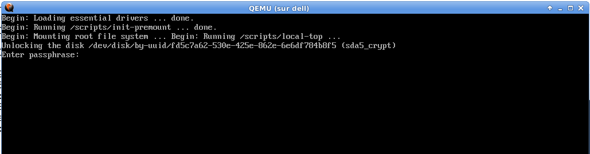
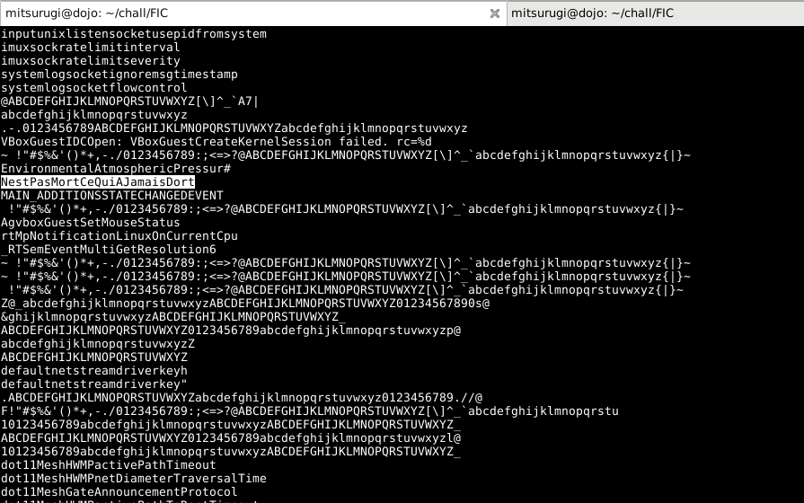

# LUKS
Le challenge indique qu'il faut trouver le mot de passe d'un utilisateur ayant un disque chiffré par LUKS.
La seule information disponible étant que le mot est long, et ne contient que des majuscules et des minuscules.

## Découverte
Le fichier fourni est un zip 7zip:
̀̀̀
mitsurugi@dojo:~/chall/FIC$ file Full.Disk.Encryption.7z 
Full.Disk.Encryption.7z: 7-zip archive data, version 0.3
mitsurugi@dojo:~/chall/FIC$ 7z x Full.Disk.Encryption.7z 

7-Zip [64] 9.20  Copyright (c) 1999-2010 Igor Pavlov  2010-11-18
p7zip Version 9.20 (locale=fr_FR.UTF-8,Utf16=on,HugeFiles=on,4 CPUs)

Processing archive: Full.Disk.Encryption.7z

Extracting  FIC.Full-Disk-Encryption.vdi

Everything is Ok

Size:       8592031744
Compressed: 2054040086
mitsurugi@dojo:~/chall/FIC$ file FIC.Full-Disk-Encryption.vdi 
FIC.Full-Disk-Encryption.vdi: VirtualBox Disk Image, major 1, minor 1 (<<< Oracle VM VirtualBox Disk Image >>>), 8589934592 bytes
mitsurugi@dojo:~/chall/FIC$
̀̀̀

Ok, un disque Virtual Box, on peut essayer de jouer un peu avec:
̀̀̀
mitsurugi@dojo:~/chall/FIC$ qemu-system-x86_64 -m 1024 FIC.Full-Disk-Encryption.vdi
̀̀̀


Et nous tombons dans l'initramfs, avec la demande de clé LUKS. Normal. Nous constatons que la partition chiffrée est la sda5_crypt.
Il est inutile de tenter de bruteforcer. En effet, LUKs implémente PBKDF2 et nous savons que le mot de passe est long. Essayons de voir autre chose.

## Attack!!
Regardons de plus près ce disque:
```
mitsurugi@dojo:~/chall/FIC$ sudo modprobe nbd max_parts=16
mitsurugi@dojo:~/chall/FIC$ sudo qemu-nbd -c /dev/nbd0 FIC.Full-Disk-Encryption.vdi 

mitsurugi@dojo:~/chall/FIC$ sudo fdisk -l /dev/nbd0 

Disque /dev/nbd0 : 8 GiB, 8589934592 octets, 16777216 secteurs
Unités : secteur de 1 × 512 = 512 octets
Taille de secteur (logique / physique) : 512 octets / 512 octets
taille d'E/S (minimale / optimale) : 512 octets / 512 octets
Type d'étiquette de disque : dos
Identifiant de disque : 0x000df54c

Device      Boot  Start      End  Sectors  Size Id Type
/dev/nbd0p1 *      2048   194559   192512   94M 83 Linux
/dev/nbd0p3      196606 16775167 16578562  7,9G  5 Extended
/dev/nbd0p5      696320 16775167 16078848  7,7G 83 Linux
/dev/nbd0p6      196608   696319   499712  244M 83 Linux

Les entrées de la table de partitions ne sont pas dans l'ordre du disque.
mitsurugi@dojo:~/chall/FIC$
```

De manière relativement simple, on imagine que la partition 1 est la partition /boot, il n'y a donc rien de vraiment intéressant là dedans. Par acquis de conscience, on peut la monter et lister les fichiers, mais rien de probant n'en ressort.

La partition 5 est la partition chiffrée, comme nous avons remarqué lors du boot sous qemu (le fameux sda5_crypt).
Mais quelle est cette partition 6?:

```
mitsurugi@dojo:~/chall/FIC$ sudo cat /dev/nbd0p6 > part6
mitsurugi@dojo:~/chall/FIC$ file part6
part6: Linux/i386 swap file (new style) with SWSUSP1 image
mitsurugi@dojo:~/chall/FIC$ 
```
Nous avons le swap. Et ce swap n'est pas chiffré, donc il pourrait y avoir des informations potentiellement très intéressantes à l'intérieur. Nous allons choisir de parcourir uniquement les chaines de caractères:

```
mitsurugi@dojo:~/chall/FIC$ strings part6 | wc -l
401877
mitsurugi@dojo:~/chall/FIC$
```
Bon inutile de lire ces 400000 lignes, intéressons nous aux "longues" lignes

```
mitsurugi@dojo:~/chall/FIC$ strings part6 | wc -l
401877
mitsurugi@dojo:~/chall/FIC$ strings -20 part6 | wc -l
31325
mitsurugi@dojo:~/chall/FIC$ strings -30 part6 | wc -l
18988
mitsurugi@dojo:~/chall/FIC$ strings -40 part6 | wc -l
11242
mitsurugi@dojo:~/chall/FIC$ strings -50 part6 | wc -l
7643
mitsurugi@dojo:~/chall/FIC$
```
Même avec 50 caractères, nous avons trop de lignes à lire. 

La deuxième information donnée nous dit que le mot de passe ne contient que des lettres minuscules et majuscules. Allons-y avec les regexp, en estimant au doigt mouillé que 25 est considéré comme long:
```
mitsurugi@dojo:~/chall/FIC$ strings part6 | grep "[a-zA-Z]\{25\}" | wc -l
248
mitsurugi@dojo:~/chall/FIC$
```

Et 248 lignes, ça se parcourt à l'oeil. Le Flag se distingue assez aisément, surtout par le fait que le flag est écrit en français, en CamelCase au milieu de termes techniques en anglais:
```
mitsurugi@dojo:~/chall/FIC$ strings part6 | grep "[a-zA-Z]\{25\}" | less
```


Ok, FLAG!
