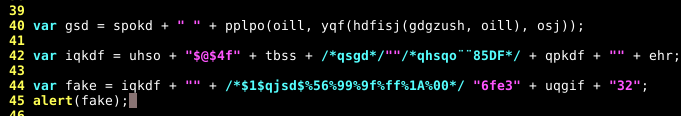
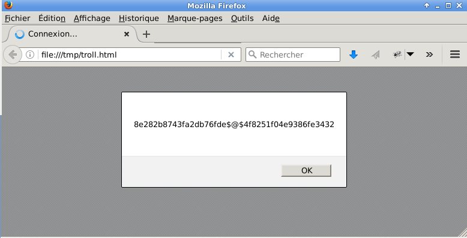

#Steg challenge1
Comme son nom l'indique, c'est de la stéganographie.


## Warm up
Pour la stégano, on utilise soit stegsolve, soit binwalk. Tentons binwalk:
```
mitsurugi@dojo:~/chall/FIC$ binwalk Steg_ch1_2k17.jpg 

DECIMAL       HEXADECIMAL     DESCRIPTION
--------------------------------------------------------------------------------
0             0x0             JPEG image data, EXIF standard
12            0xC             TIFF image data, big-endian
17780         0x4574          Copyright string: " (c) 1998 Hewlett-Packard Companyny"
123973        0x1E445         POSIX tar archive

mitsurugi@dojo:~/chall/FIC$
```

Mieux vaut tar que jamais:
```
mitsurugi@dojo:~/chall/FIC$ binwalk -e Steg_ch1_2k17.jpg 

DECIMAL       HEXADECIMAL     DESCRIPTION
--------------------------------------------------------------------------------
0             0x0             JPEG image data, EXIF standard
12            0xC             TIFF image data, big-endian
17780         0x4574          Copyright string: " (c) 1998 Hewlett-Packard Companyny"
123973        0x1E445         POSIX tar archive

mitsurugi@dojo:~/chall/FIC$ cd _Steg_ch1_2k17.jpg.extracted
mitsurugi@dojo:~/chall/FIC/_Steg_ch1_2k17.jpg.extracted$ ls -l
total 160
-rw-r--r-- 1 mitsurugi mitsurugi 78336 janv. 30 14:13 1E445.tar
-rwxr-xr-x 1 mitsurugi mitsurugi   198 oct.  14 12:09 catch_this_pass.7z
-rwxr-xr-x 1 mitsurugi mitsurugi 73445 oct.  14 12:02 open_me.zip
-rwxr-xr-x 1 mitsurugi mitsurugi  1479 oct.  28 03:01 troll.js
mitsurugi@dojo:~/chall/FIC/_Steg_ch1_2k17.jpg.extracted$ 7z x catch_this_pass.7z 

7-Zip [64] 9.20  Copyright (c) 1999-2010 Igor Pavlov  2010-11-18
p7zip Version 9.20 (locale=fr_FR.UTF-8,Utf16=on,HugeFiles=on,4 CPUs)

Processing archive: catch_this_pass.7z

Enter password (will not be echoed) :

Error: Can not open encrypted archive. Wrong password?

mitsurugi@dojo:~/chall/FIC/_Steg_ch1_2k17.jpg.extracted$ unzip open_me.zip 
Archive:  open_me.zip
   skipping: chall_steg_1.jpg        need PK compat. v6.3 (can do v4.6)
mitsurugi@dojo:~/chall/FIC/_Steg_ch1_2k17.jpg.extracted$ 7z x open_me.zip 

7-Zip [64] 9.20  Copyright (c) 1999-2010 Igor Pavlov  2010-11-18
p7zip Version 9.20 (locale=fr_FR.UTF-8,Utf16=on,HugeFiles=on,4 CPUs)

Processing archive: open_me.zip

Extracting  chall_steg_1.jpg
Enter password (will not be echoed) :
     Data Error in encrypted file. Wrong password?

Sub items Errors: 1

mitsurugi@dojo:~/chall/FIC/_Steg_ch1_2k17.jpg.extracted$

```

Deux zip qui sont chiffrés, et troll.js. Le nom de ce javascript n'est pas très encourageant, mais faute de mieux, autant le lire.

## Go for flag!
Le contenu de troll.js montre une certaine obfuscation:
```
var gsd = "RO";
var kldsd = "T1";
var ij = "3";
var oill = " ! ";
var uhui = "rsqc";
var ttty = "rs-as";
var jdf = gsd + kldsd;
var dyi = ttty + oill;
var spokd = "bonjour";
var osj = jdf + ij /* %06%5F%88 */ + " : ";

function pplpo(etb, pajjd){
	var hegb =/* while(1) echo troll */ etb + /*\"""\/\*\//*/pajjd;
	return hegb;
}

var gdgzush = hdfisj(uhui, dyi);
var /*%00%01%02*/ dkkqhg = "8e282b87";  

function yqf(jbdf, zjje){
	return hdfisj/* -- hqgdfjqs%86qf$sqjdh$*/(zjje, jbdf);
}

var ehr = "f04e938";
var uhso = dkkqhg + "43fa2db76fde";

//@Q29weXJpZ2h0== x47/x75/x69/x6c/x6c/x61/x75/x6d/x65 Thvyynhzr

function /***$1$qsd$qdjhsfqhd **/hdfisj(jdsioj, ofze5zr){
	return pplpo(ofze5zr, jdsioj);
}

var uqgif = "4";
var qpkdf = "51";
var tbss = "82";
/*4f8251*///%9f%00/*f04e9386fe*///%ff%53/*3432*/
var jgpo = yqf(qpkdf, tbss);


var gsd = spokd + " " + pplpo(oill, yqf(hdfisj(gdgzush, oill), osj));

var iqkdf = uhso + "$@$4f" + tbss + /*qsgd*/""/*qhsqo��85DF*/ + qpkdf + "" + ehr;

var fake = iqkdf + "" + /*$1$qjsd$%56%99%9f%ff%1A%00*/ "6fe3" + uqgif + "32";


function qosdoaaqksjd_qjsdb(IQpsOJZ,uhqfd, oqsd){
	var gsm = "" + oqsd + /* "ks9qe9pll" */ + "" + uhqfd + IQpsOJZ + "ain"
	alert(gsm);
}

/* Not Here */

var jsqoddf = "%50";
var sjbbcj = "/45/25/85/6f";
var plop = "try ";
var Var = "or" ;
var sdllm = "Err";
var pmmidah_dsb_hdhsf = Var + sdllm;

qosdoaaqksjd_qjsdb(" ag", plop, pmmidah_dsb_hdhsf);
```

Une analyse à l'oeil permet de voir deux points intéressants: Seule la variable gsm sera affichée, et les variables gsd et fake sont assignées (iqkdf est utilisé pour construire fake). Nous sommes dans troll.js, et une variable s'appelle "fake"? Seems Legit! On lance un navigateur, après avoir ajouté la ligne alert(fake).


```
mitsurugi@dojo:~/chall/FIC$$ cat troll.html 
<HTML>
<script src=troll.js></script>
</HTML>
mitsurugi@dojo:~/chall/FIC$
```

Nous obtenons quelquechose qui ressemble à un mot de passe:


```
8e282b8743fa2db76fde$@$4f8251f04e9386fe3432
```
Nous avons deux fichiers zippés avec mot de passe, tentons les.

```
mitsurugi@dojo:~/chall/FIC/_Steg_ch1_2k17.jpg.extracted$ 7z x catch_this_pass.7z

7-Zip [64] 9.20  Copyright (c) 1999-2010 Igor Pavlov  2010-11-18
p7zip Version 9.20 (locale=fr_FR.UTF-8,Utf16=on,HugeFiles=on,4 CPUs)

Processing archive: catch_this_pass.7z

Enter password (will not be echoed) :

Error: Can not open encrypted archive. Wrong password?

mitsurugi@dojo:~/chall/FIC/_Steg_ch1_2k17.jpg.extracted$ 7z x open_me.zip 

7-Zip [64] 9.20  Copyright (c) 1999-2010 Igor Pavlov  2010-11-18
p7zip Version 9.20 (locale=fr_FR.UTF-8,Utf16=on,HugeFiles=on,4 CPUs)

Processing archive: open_me.zip

Extracting  chall_steg_1.jpg
Enter password (will not be echoed) :


Everything is Ok

Size:       90644
Compressed: 73445
mitsurugi@dojo:~/chall/FIC/_Steg_ch1_2k17.jpg.extracted$
```

Ok, nous avons une image sur les deux. Regardons son contenu:

```
mitsurugi@dojo:~/chall/FIC/_Steg_ch1_2k17.jpg.extracted$ strings chall_steg_1.jpg 
 ( ... )
%$)$
kzU`
'Q<3
0XMS
<B0)	
u%s4
K'n~#
bSq}4
flag_cdaisi-fic-2k17.j
r&u9
FeC02*1
jm	JL
~Puw
mitsurugi@dojo:~/chall/FIC/_Steg_ch1_2k17.jpg.extracted$ strings chall_steg_1.jpg 
```

Quelquefois, le FLAG tombe alors qu'on ne s'y attend pas. \o/
